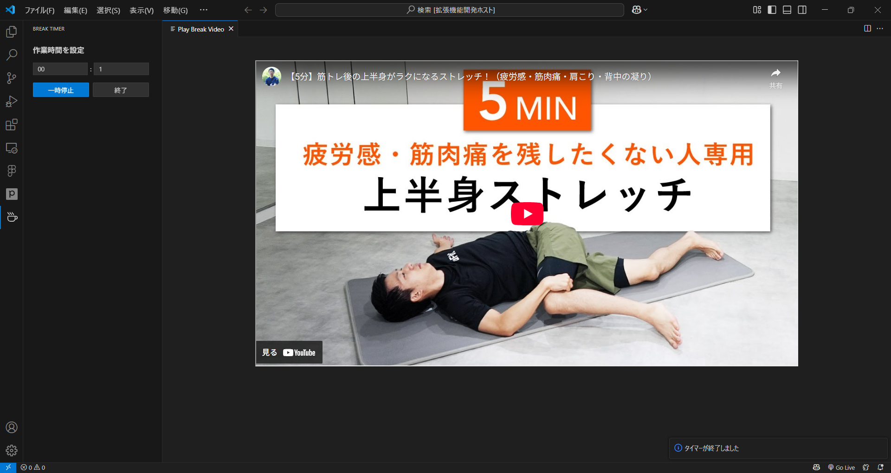

# 休憩タイマー (Break Timer)

VSCodeでの作業中に、適切な休憩を促してくれる拡張機能です。  
時間を指定すると、設定時間の経過後に休憩メッセージを表示し、さらに「ストレッチする」ボタンからストレッチ動画を見ることもできます。

---

## 🕒 主な機能

- 入力した時間（例：`1:00`）の経過後に、**休憩を促す通知**を表示
- 「ストレッチする」ボタンで、**YouTubeのストレッチ動画**を再生

---

## ⚠️ ご注意

この拡張機能は **一部の最新バージョンのVSCodeでは正常に動作しない可能性** があります。  
特に、WebViewにおけるセキュリティポリシーの変更により、**YouTube動画が再生できない**事例が報告されています。

> ✅ 動作確認済み：VSCode v1.79.2 など  
> ❌ 動作に問題あり：VSCode v1.88以降（WebView制限あり）

---

## 📸 スクリーンショット

> 

> 

>

---

## 🚀 使い方

1. アイコンをクリック
2. 「1:00」など、時間を `mm:ss` 形式で入力
3. 指定時間が経過するとポップアップで休憩を促されます
4. 「ストレッチする」ボタンをクリックすると、YouTube動画が新しいタブで再生されます

---